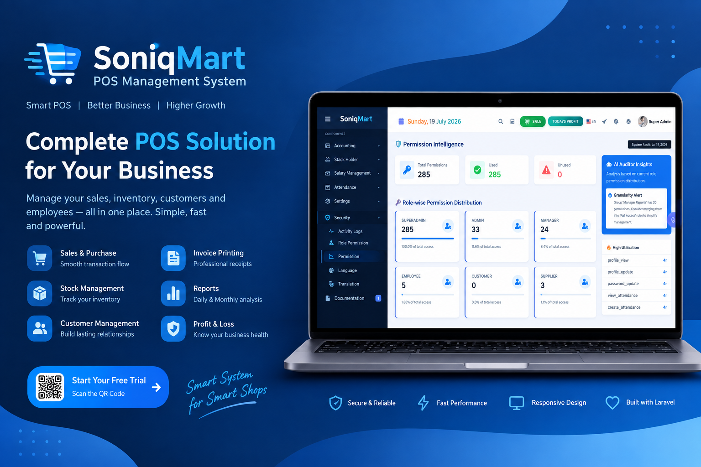
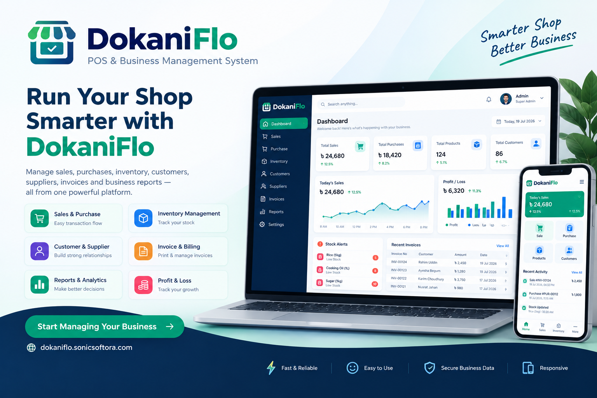
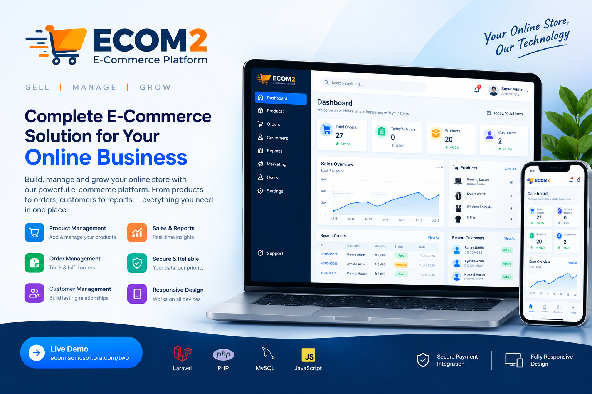
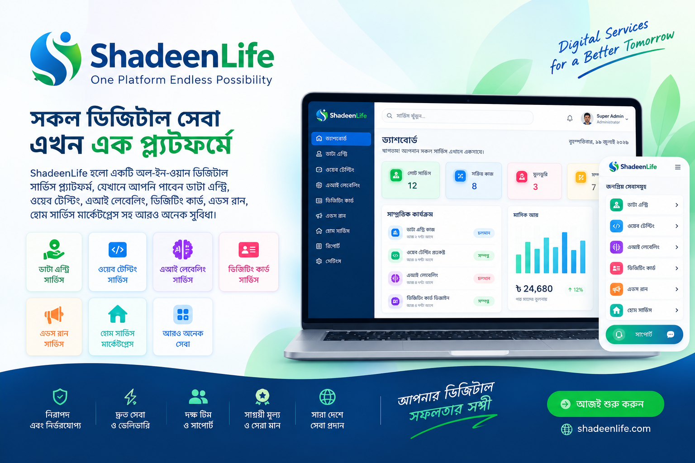

# 👋 Hi, I’m Shahadat Ullah (@srshahadat)

\*\*Founder \& Principal Architect at SonicSoftora Limited.\*\*
I Specialize in designing scalable AI-driven SaaS platforms, complex data architectures, and robust business logic. With expertise across the full stack -including Laravel and PHP- I focus on building high-impact digital solutions and scalable software infrastructure.
---

## 📫 How to Reach Me

---

## 🌍 Connect With Me

---

## 🛠️ Skills & Tools

### 💻 Backend & Frameworks

  

### 🎨 Frontend

  

### 🗄️ Database & DevOps

  

### 🧰 Development Tools

---

## 🚀 Featured Projects

> Building practical software solutions that solve real business problems — from
> POS and e-commerce to billing automation and digital service platforms.

**💻 SaaS & Business Software** &nbsp; • &nbsp;
**🛒 E-commerce** &nbsp; • &nbsp;
**📊 Management Systems** &nbsp; • &nbsp;
**🌐 Digital Platforms**

 

<table>
<tr>

<td width="50%" valign="top">

<h3>🛒 SoniqMart POS</h3>

A complete <strong>POS & Business Management System</strong> designed for retail
businesses to manage sales, purchases, inventory, customers, suppliers,
invoices, reports, and daily operations from one platform.

  

<strong>Tech Stack:</strong> 
Laravel · PHP · MySQL · JavaScript

🔗 <a href="https://pos.sonicsoftora.com">Live Demo</a>

</td>

<td width="50%" valign="top">

<h3>💼 BillTuli</h3>

A <strong>subscription and billing management platform</strong> built for
businesses and service providers to manage recurring bills, customers,
subscriptions, invoices, collections, and payments efficiently.

  

<strong>Tech Stack:</strong> 
Laravel · PHP · MySQL

🔗 <a href="https://billtuli.com">Visit BillTuli</a>

</td>

</tr>

<tr>

<td width="50%" valign="top">

<h3>🏪 DokaniFlo</h3>

A modern <strong>POS & Business Management System</strong> built to simplify
shop operations with sales, purchases, inventory, customers, suppliers,
invoices, reports, and business analytics.

  

<strong>Tech Stack:</strong> 
Laravel · PHP · MySQL · JavaScript

🔗 <a href="https://dokaniflo.sonicsoftora.com">Visit DokaniFlo</a>

</td>

<td width="50%" valign="top">

<h3>🛍️ ECOM2</h3>

A scalable <strong>E-commerce Platform</strong> designed to help businesses
build, manage, and grow their online stores with product management,
order management, customers, reports, and online sales.

  

<strong>Tech Stack:</strong> 
Laravel · PHP · MySQL · JavaScript

🔗 <a href="https://ecom.sonicsoftora.com/two">Live Project</a>

</td>

</tr>

<tr>

<td width="50%" valign="top">

<h3>🌐 ShadeenLife</h3>

An <strong>all-in-one digital services platform</strong> connecting users with
digital services, earning opportunities, marketplaces, and other online
solutions through a single ecosystem.

  

<strong>Tech Stack:</strong> 
Laravel · PHP · MySQL · JavaScript

🔗 <a href="https://shadeenlife.com">Visit Website</a>

</td>

<td width="50%" valign="top">

<h3>💡 More Projects Coming Soon</h3>

Currently working on new SaaS products, business automation tools,
AI-powered solutions, and scalable digital platforms.

 

  🚀 <strong>Building. Scaling. Innovating.</strong>

</td>

</tr>

</table>

---

### 📊 GitHub Stats:

  

## 📊 GitHub Statistics

  
  

---

✨ *This README is special because it appears on my GitHub profile. Let’s connect and build something great together!*  
